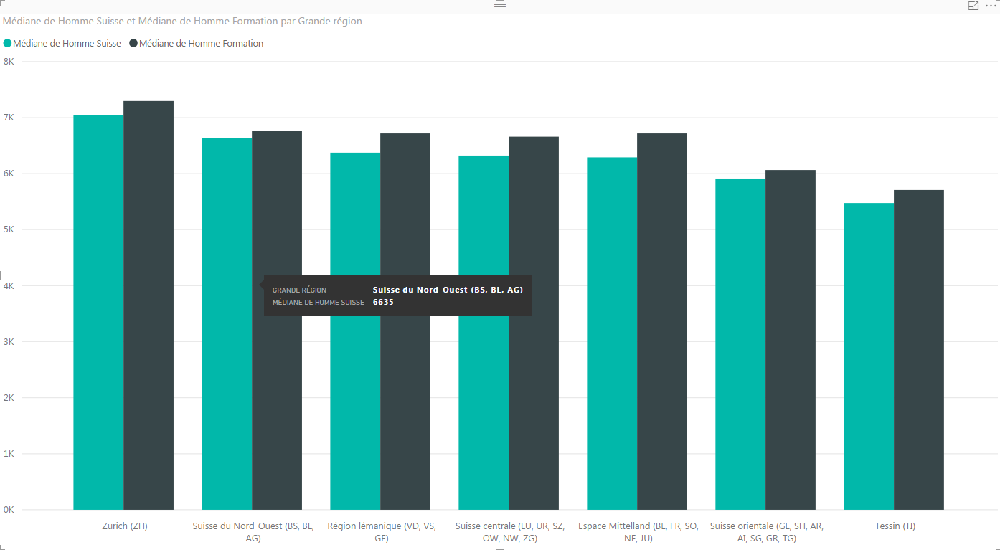

# Où est-ce le plus rentable d'être diplômé en Suisse?
## Introduction  
Le but de cette démarche est de pouvoir répondre à la question: `Où est-ce le plus rentable d'être diplômé en Suisse?`.
Pour ça il faut commencer par savoir quelle est la moyenne des salaires par région, pour ensuite pouvoir combiner ces résultats avec la moyenne des salaires de personnes diplômées par région.

## Méthodes  
### Statistiques utilisées  
Pour pouvoir répondre à la question j'ai pris, d'un côté, des statistiques qui concernent le salaire médian en suisse, et de l'autre côté des chiffres concernant le salaire médian avec formation en suisse.  

### Source des données  
Toutes les sources de données proviennent du site [opendata.swiss](https://opendata.swiss/fr/) qui est le site suisse de données libres d'accès.  

### Traitement des données  
Les données brutes on été nettoyées a l'aide d'un script en ruby qui enlève les informations inutiles tel que l'entête swiss opendata, mais aussi a formater les valeures et changer le nom des colonnes.

## Résultats  
D'après les chiffres obtenus la région qui a la différence la plus grande entre les personnes avec une formation et les non diplômées est, Espace Mittelland (BE, FR, SO, NE, JU), avec 500.- CHF de plus pour les personnes formées.  

## Conclusion
Il aurait été intéressant d'avoir a disposition le salaire médian des suisses non diplômés, car dans la source de données actuelle des salaires suisses il y a tous les salaires, avec et sans diplôme confondus. Mais malgré ça on arrive quand même a voir une différence et se rendre compte que peut importe la region, quelqu'un diplômé gagné en moyenne plus qu'une personne qui ne l'est pas.
